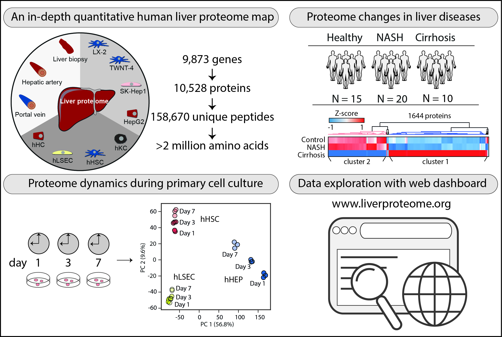

# Human liver proteome atlas project
- Link to bioRxiv preprint: [Dynamic human liver proteome atlas reveals functional insights into disease pathways](https://www.biorxiv.org/content/10.1101/2022.01.28.478194v1.full)
- This repository contains scripts used for bioinformatics analysis in the project and source code for the web-based dashboard application at www.liverproteome.org

## Contents

file                      | description
------------------------- | --------------------------------------
[LiverAtlas_PA](LiverAtlas_PA/Atlas_upload.ipynb)    | Contains data pre-processing, statistical tests and figures.
[LiverAtlas_DashApp](LiverAtlas_DashApp/liveratlas_v2.py)    | Contains source code for the web-based dashboard application. 

## Disclaimer
Source data for the web-based dashboard application is not available due to continuous development of the webpage and the need to maintain potential patient-sensitive data. 
However, the webpage is freely available at www.liverproteome.org

## Summary of the study

